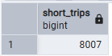
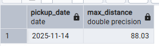
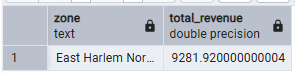
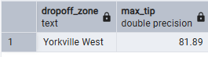

# Module 1 Homework - Docker & SQL

**Student:** Ellie Pascaud  
**Course:** Data Engineering Zoomcamp 2026  
**Module:** 1 - Docker & SQL

---

## 📋 Answers

### Question 1: Understanding Docker images

**Question:** What's the version of pip in the python:3.13 image?

**Command:**
```bash
docker run -it --entrypoint bash python:3.13
pip --version
```

**Answer:** `25.3`

---

### Question 2: Understanding Docker networking

**Question:** What hostname and port should pgadmin use to connect to postgres?

**Answer:** `db:5432`

**Explanation:**
- From **inside the Docker network** (where pgAdmin runs), containers communicate using their **service names** as hostnames
- Service name in docker-compose.yaml: `db`
- **Internal port** (inside container): `5432` (not 5433 which is the external port mapping)
- External mapping `5433:5432` means: host machine port 5433 → container port 5432

---

### Question 3: Counting short trips

**Question:** How many trips in November 2025 had trip_distance <= 1 mile?

**Query:**
```sql
SELECT COUNT(*) as short_trips
FROM green_taxi_trips
WHERE lpep_pickup_datetime >= '2025-11-01'
  AND lpep_pickup_datetime < '2025-12-01'
  AND trip_distance <= 1;
```

**Answer:** `8007`  


---

### Question 4: Longest trip for each day

**Question:** Which pickup day had the longest trip distance (< 100 miles)?

**Query:**
```sql
SELECT 
    DATE(lpep_pickup_datetime) as pickup_date,
    MAX(trip_distance) as max_distance
FROM green_taxi_trips
WHERE trip_distance < 100
GROUP BY DATE(lpep_pickup_datetime)
ORDER BY max_distance DESC
LIMIT 1;
```

**Answer:** `2025-11-14`


---

### Question 5: Biggest pickup zone

**Question:** Which pickup zone had the largest total_amount on November 18, 2025?

**Query:**
```sql
SELECT 
    z.zone,
    SUM(t.total_amount) as total_revenue
FROM green_taxi_trips t
JOIN taxi_zones z ON t.pulocationid = z.locationid
WHERE DATE(t.lpep_pickup_datetime) = '2025-11-18'
GROUP BY z.zone
ORDER BY total_revenue DESC
LIMIT 1;
```

**Answer:** `East Harlem North`


---

### Question 6: Largest tip

**Question:** For pickups in "East Harlem North" in November 2025, which dropoff zone had the largest tip?

**Query:**
```sql
SELECT 
    zdo.zone as dropoff_zone,
    MAX(t.tip_amount) as max_tip
FROM green_taxi_trips t
JOIN taxi_zones zpu ON t.pulocationid = zpu.locationid
JOIN taxi_zones zdo ON t.dolocationid = zdo.locationid
WHERE zpu.zone = 'East Harlem North'
  AND t.lpep_pickup_datetime >= '2025-11-01'
  AND t.lpep_pickup_datetime < '2025-12-01'
GROUP BY zdo.zone
ORDER BY max_tip DESC
LIMIT 1;
```

**Answer:** `Yorkville` 


---

### Question 7: Terraform Workflow

**Question:** Which sequence describes the Terraform workflow?

**Answer:** `terraform init, terraform apply -auto-approve, terraform destroy`

**Explanation:**
- `terraform init` - Downloads provider plugins and sets up backend
- `terraform apply -auto-approve` - Generates and auto-executes the plan
- `terraform destroy` - Removes all resources managed by Terraform

---

## 🔧 How to Run

### Prerequisites
```bash
# Start database
docker compose up -d

# Verify data is loaded
python -m pipeline.cli list-tables
```

### Run SQL Queries

**Option 1: psql**
```bash
docker exec -it <postgres-container> psql -U postgres -d ny_taxi
\i queries/homework_queries.sql
```

**Option 2: pgAdmin**
1. Open http://localhost:8080
2. Login: pgadmin@pgadmin.com / Password: pgadmin
3. Connect to database (host: `db`, port: `5432`)
4. Run queries from Query Tool

**Option 3: Python**
```bash
python scripts/run_homework_queries.py
```

---

## 📊 Data Pipeline

This homework uses a production-ready data pipeline:

- **Data Source:** NYC TLC Green Taxi trips (November 2025)
- **Database:** PostgreSQL 17
- **Ingestion:** Python pipeline with pandas + SQLAlchemy
- **Features:**
  - Idempotent loading (safe re-runs)
  - Column normalization (lowercase for PostgreSQL/dbt)
  - Comprehensive testing (26 unit tests)
  - Professional CLI with Click

See [pipeline/](./pipeline/) for implementation details.

---

## 🗂️ Repository Structure

```
01-docker-terraform/
├── pipeline/               # Data ingestion pipeline
│   ├── cli.py             # Command-line interface
│   ├── config.py          # Configuration management
│   ├── database.py        # Database operations
│   └── data_loader.py     # Data loading utilities
├── queries/               # SQL queries for homework
├── docs/                  # Sceenshots of SQL
├── notebooks/             # Data exploration
├── tests/                 # Comprehensive test suite
├── terraform              # Terraform scripts
├── docker-compose.yaml    # Infrastructure setup
├── pytest.ini             # Test configuration
└── README.md              # This file / Presentation
```

---

## ✅ Verification

All queries were tested against the loaded dataset:
- **Total trips:** 46,912
- **Date range:** 2025-11-01 to 2025-11-30
- **Zones:** 265 NYC taxi zones

---

## 🎓 Learnings

Key takeaways from Module 1:

1. **Docker networking** - Container-to-container vs host-to-container communication
2. **PostgreSQL** - Normalization, indexes, and query optimization
3. **Data pipeline patterns** - Idempotence, validation, error handling
4. **Testing** - Unit vs integration tests, pytest markers
5. **Terraform** - IaC workflow (init, plan, apply, destroy)

---

## 🔗 Links

- **Course:** [Data Engineering Zoomcamp](https://github.com/DataTalksClub/data-engineering-zoomcamp/)
- **Module 1:** Docker & SQL
- **Dataset:** [NYC TLC Trip Data](https://www.nyc.gov/site/tlc/about/tlc-trip-record-data.page)

---


## 🎯 Overview
Production-ready NYC Taxi data pipeline with Docker, PostgreSQL, and modern Python tools. Features idempotent data loading, professional CLI, comprehensive testing, and column normalization for future dbt compatibility.

**Key Features:**
- ✅ Idempotent pipeline (safely re-runnable)
- ✅ Column normalization (lowercase for PostgreSQL/dbt)
- ✅ Professional CLI with Click
- ✅ Comprehensive testing (65% coverage)
- ✅ Modern tooling (`uv` for dependencies)
- ✅ Well-documented (DECISIONS.md + DEVLOG.md)

## 🏗️ Architecture

```
pipeline/
├── config.py      -> Configuration management (.env loading + validation)
├── database.py    -> Database operations (pooling, idempotence, utilities)
├── data_loader.py -> Data loading with column normalization
├── cli.py         -> Command-line interface (Click)
└── ingest_pipeline.py -> Main orchestrator (simple script mode)
```

**Design decisions:** See [DECISIONS.md](DECISIONS.md)  
**Learning journey:** See [DEVLOG.md](DEVLOG.md)

### Key Design Decisions

1. **Column normalization to lowercase** (CRITICAL for dbt in Module 4)
2. **`if_exists='replace'` for idempotence** (safe re-runs)
3. **Modular architecture** (testable, maintainable)
4. **Click CLI** (professional interface)
5. **`uv` for dependency management** (10-100x faster than pip)

## 📦 Installation

### Prerequisites
- Python 3.11+
- Docker Desktop
- `uv` package manager (recommended)

### Setup

```bash
# 1. Install uv (if not already installed)
curl -LsSf https://astral.sh/uv/install.sh | sh

# 2. Clone repository
git clone [repo-url]
cd 01-docker-terraform

# 3. Create virtual environment
# Create virtual environment
uv venv

# Activate virtual environment
source .venv/bin/activate        # Linux/Mac/WSL
# source .venv/Scripts/activate    # Windows Git Bash

# Check venv is created
which python         # résultat expected: .../01-docker-terraform/.venv/Scripts/python
echo $VIRTUAL_ENV   # result expected : .../01-docker-terraform/.venv

# 4. Install dependencies
uv pip install -r requirements.txt

# 5. Setup environment
cp .env.example .env
# Edit .env with your settings (default values work)

# 6. Start database
docker compose up -d

# 7. Download data (if not already present) 
mkdir -p data
# Linux: 
wget https://d37ci6vzurychx.cloudfront.net/trip-data/green_tripdata_2025-11.parquet -P data/
wget https://github.com/DataTalksClub/nyc-tlc-data/releases/download/misc/taxi_zone_lookup.csv -P data/
# Microsoft Bash
curl -o data/green_tripdata_2025-11.parquet https://d37ci6vzurychx.cloudfront.net/trip-data/green_tripdata_2025-11.parquet
curl -o data/taxi_zone_lookup.csv https://github.com/DataTalksClub/nyc-tlc-data/releases/download/misc/taxi_zone_lookup.csv
```

## 🚀 Usage

### Option 1: Local with CLI (Recommended)

Run directly on your machine with `uv`:

### Option 2: Docker (Production-Ready)

Run in containerized environment:

Run pipeline in containerized environment:
```bash
# Build image
docker build -t nyc-taxi-pipeline:latest .

# Run pipeline with docker-compose database
docker run --rm \
  --network 01-docker-terraform_default \
  -e POSTGRES_HOST=postgres \
  -e POSTGRES_PORT=5432 \
  -v "$(pwd)/data:/app/data" \
  nyc-taxi-pipeline:latest

# Run CLI commands via Docker
docker run --rm \
  --network 01-docker-terraform_default \
  -e POSTGRES_HOST=postgres \
  -e POSTGRES_PORT=5432 \
  --entrypoint python \
  nyc-taxi-pipeline:latest \
  -m pipeline.cli list-tables

docker run --rm \
  --network 01-docker-terraform_default \
  -e POSTGRES_HOST=postgres \
  -e POSTGRES_PORT=5432 \
  --entrypoint python \
  nyc-taxi-pipeline:latest \
  -m pipeline.cli verify green_taxi_trips
```

**Why Docker:**
- ✅ Reproducible environment
- ✅ No local Python setup needed
- ✅ Production-ready (Kubernetes/ECS compatible)
- ✅ Multi-stage build (~200MB image)

### Option 3: CLI (Recommended for Development)

```bash
# Run full pipeline
uv run python -m pipeline.cli ingest

# Run with options
uv run python -m pipeline.cli ingest --force          # Skip confirmation => to use for the score
uv run python -m pipeline.cli ingest --skip-zones     # Load only trips
uv run python -m pipeline.cli ingest --pg-port=5433   # Override port

# Verify data
uv run python -m pipeline.cli verify green_taxi_trips

# Check pipeline status
uv run python -m pipeline.cli status

# Drop table (with confirmation)
uv run python -m pipeline.cli drop green_taxi_trips
```

### Option 2: Simple Script

```bash
# Run main script
uv run python -m pipeline.ingest_pipeline
```

### CLI Commands

```bash
# Available commands
uv run python -m pipeline.cli --help

Commands:
  ingest   Ingest NYC taxi data into PostgreSQL
  verify   Verify data in a table
  status   Show pipeline status (connection + tables)
  drop     Drop a table (with confirmation)
```

## 🧪 Testing

### Run Tests

```bash
# All tests
uv run pytest -v --cov=pipeline

# Unit tests only (no database needed)
uv run pytest -v -m "not integration"

# Integration tests (requires docker-compose up)
uv run pytest -v -m integration

# Specific test file
uv run pytest tests/test_data_loader.py -v

# With coverage report
uv run pytest --cov=pipeline --cov-report=html
open htmlcov/index.html
```

### Test Coverage

**Current:** ~65%

**Prioritized tests:**
- ✅ Column normalization (CRITICAL for dbt)
- ✅ Idempotence (re-run safety)
- ✅ Expected schema validation
- ✅ Configuration validation
- ✅ Database operations


## 🧠 What I Learned

See [DEVLOG.md](DEVLOG.md) for detailed learning journey.

**Key takeaways:**
1. **PostgreSQL column handling:** Lowercasing is critical for dbt compatibility (Module 4)
2. **Idempotence:** `if_exists='replace'` makes pipeline safely re-runnable
3. **Connection pooling:** 10x performance improvement with `pool_pre_ping=True`
4. **Click CLI:** Professional interface with minimal code
5. **`uv` speed:** 15x faster than pip for dependency installation
6. **Test invariants:** Focus on critical properties (normalization, idempotence)

## 🏗️ Design Decisions

See [DECISIONS.md](DECISIONS.md) for full Architecture Decision Records.

**Major decisions:**
1. **Normalize columns to lowercase** - Critical for dbt (Module 4)
2. **`.env` for configuration** - Industry standard for secrets
3. **`if_exists='replace'` for idempotence** - Simple and safe
4. **Modular architecture** - Testable and maintainable
5. **Click CLI** - Professional interface
6. **`uv` for dependencies** - Modern and fast

## 🚧 Challenges & Solutions

### Challenge: Column Name Case Sensitivity
**Problem:** PostgreSQL lowercases unquoted identifiers, breaking queries.

**Solution:** Normalize all columns to lowercase at load time:
```python
df.columns = df.columns.str.lower().str.replace(' ', '_')
```

**Impact:** Clean SQL everywhere, especially important for dbt in Module 4.

### Challenge: Docker Networking
**Problem:** Can't connect from host to PostgreSQL in container.

**Solution:** Use port mapping `5433:5432` and `localhost` from host.

### Challenge: Idempotence
**Problem:** Re-running pipeline created duplicates.

**Solution:** Use `if_exists='replace'` in pandas `to_sql()`.


